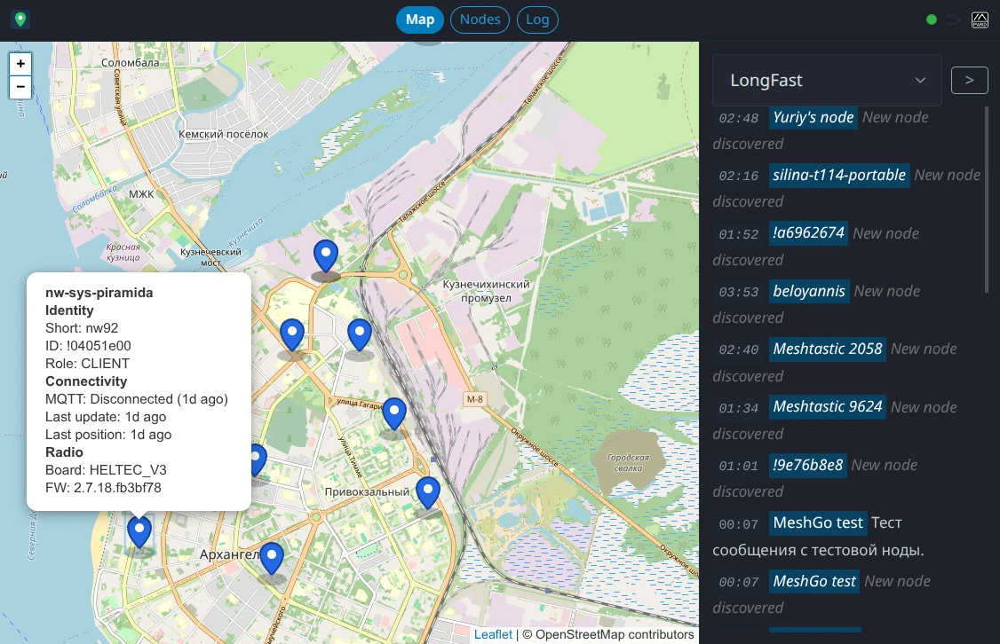
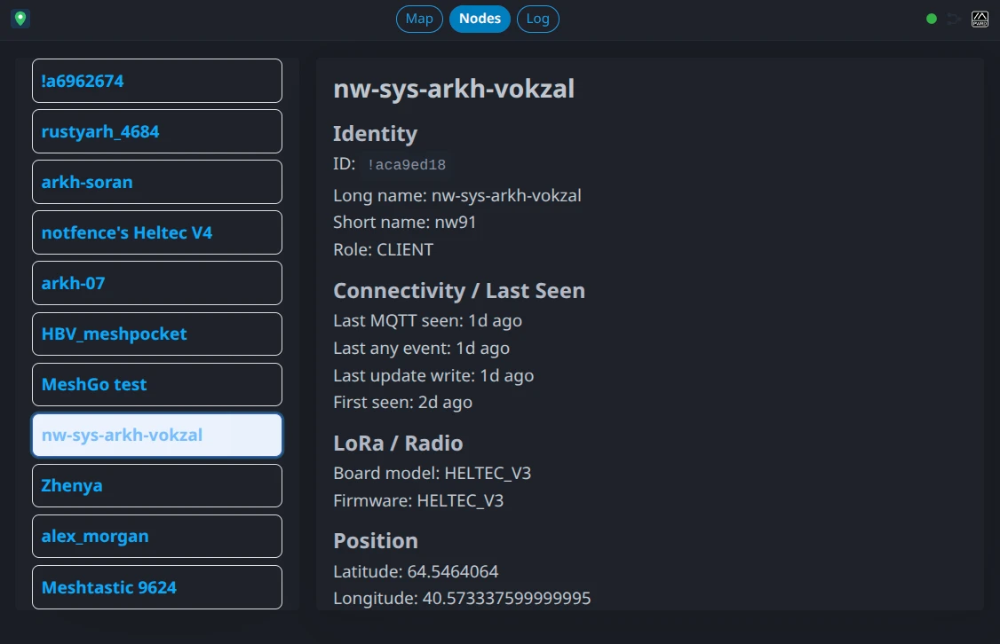
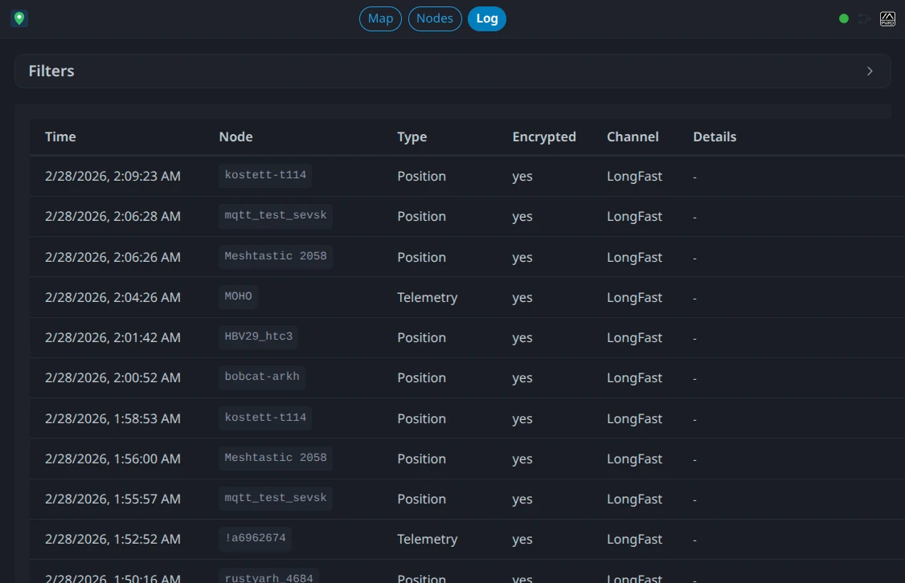

# MeshMap Lite

[](https://ci.skobk.in/repos/6)
[](https://git.skobk.in/skobkin/meshmap-lite/releases)

Lightweight read-only Meshtastic regional map and chat viewer.

## Screenshots



<details>
<summary>Node details</summary>


</details>
<details>
<summary>Event log</summary>


</details>

## Run locally

1. `go run ./cmd/server --config ./config.example.yaml`
2. Open `http://localhost:8080`

## Run in Docker

[`skobkin/meshmap-lite`](https://hub.docker.com/r/skobkin/meshmap-lite) Docker image is available for deploy.

Docker Compose [example](https://git.skobk.in/skobkin/docker-stacks/src/branch/master/meshmap-lite).

## Frontend dev

1. `cd web`
2. `npm install`
3. `npm run dev`

## Config

YAML and `MML_` environment variables are supported. ENV keys use `__` as nesting separator.

Example:

```bash
MML_MQTT__ROOT_TOPIC=msh/RU/ARKH
MML_CHANNELS__LONGFAST__PRIMARY=true
```

Reference:

| YAML key                           | ENV key                                  | Default                                               | Description                                                                           |
|------------------------------------|------------------------------------------|-------------------------------------------------------|---------------------------------------------------------------------------------------|
| `mqtt.host`                        | `MML_MQTT__HOST`                         | `""`                                                  | MQTT broker host.                                                                     |
| `mqtt.port`                        | `MML_MQTT__PORT`                         | `1883`                                                | MQTT broker port.                                                                     |
| `mqtt.tls`                         | `MML_MQTT__TLS`                          | `false`                                               | Enable TLS for MQTT connection.                                                       |
| `mqtt.client_id`                   | `MML_MQTT__CLIENT_ID`                    | auto-generated stable ID                              | MQTT client ID. Set to keep broker session identity explicit.                         |
| `mqtt.username`                    | `MML_MQTT__USERNAME`                     | `""`                                                  | MQTT username.                                                                        |
| `mqtt.password`                    | `MML_MQTT__PASSWORD`                     | `""`                                                  | MQTT password.                                                                        |
| `mqtt.root_topic`                  | `MML_MQTT__ROOT_TOPIC`                   | `""`                                                  | Root Meshtastic topic prefix. Required.                                               |
| `mqtt.protocol_version`            | `MML_MQTT__PROTOCOL_VERSION`             | `"3.1.1"`                                             | MQTT protocol version.                                                                |
| `mqtt.subscribe_qos`               | `MML_MQTT__SUBSCRIBE_QOS`                | `1`                                                   | MQTT subscription QoS.                                                                |
| `mqtt.clean_session`               | `MML_MQTT__CLEAN_SESSION`                | `false`                                               | MQTT clean session flag.                                                              |
| `mqtt.reconnect_timeout`           | `MML_MQTT__RECONNECT_TIMEOUT`            | `10s`                                                 | Reconnect timeout.                                                                    |
| `mqtt.connect_timeout`             | `MML_MQTT__CONNECT_TIMEOUT`              | `10s`                                                 | Connection timeout.                                                                   |
| `mqtt.keepalive`                   | `MML_MQTT__KEEPALIVE`                    | `60s`                                                 | MQTT keepalive interval.                                                              |
| `storage.kv.driver`                | `MML_STORAGE__KV__DRIVER`                | `"memory"`                                            | Dedup KV backend driver. Only `memory` is supported.                                  |
| `storage.kv.size`                  | `MML_STORAGE__KV__SIZE`                  | `100000`                                              | Dedup KV max entries.                                                                 |
| `storage.kv.ttl`                   | `MML_STORAGE__KV__TTL`                   | `6h`                                                  | Dedup KV entry TTL.                                                                   |
| `storage.sql.driver`               | `MML_STORAGE__SQL__DRIVER`               | `"sqlite"`                                            | SQL backend driver. Only `sqlite` is supported.                                       |
| `storage.sql.url`                  | `MML_STORAGE__SQL__URL`                  | `"/data/db.sqlite"`                                   | SQL connection URL/path.                                                              |
| `storage.sql.auto_migrate`         | `MML_STORAGE__SQL__AUTO_MIGRATE`         | `true`                                                | Run DB migrations on startup.                                                         |
| `storage.sql.log_max_rows`         | `MML_STORAGE__SQL__LOG_MAX_ROWS`         | `50000`                                               | Max number of log rows to keep. `0` disables pruning.                                 |
| `storage.sql.log_prune_batch_rows` | `MML_STORAGE__SQL__LOG_PRUNE_BATCH_ROWS` | `1000`                                                | Extra rows allowed above cap before prune runs; prune then shrinks back to max rows.  |
| `map_reports.enabled`              | `MML_MAP_REPORTS__ENABLED`               | `true`                                                | Enable map report ingest.                                                             |
| `map_reports.topic_suffix`         | `MML_MAP_REPORTS__TOPIC_SUFFIX`          | `"2/map"`                                             | Topic suffix for map reports under root topic.                                        |
| `channels[]`                       | `MML_CHANNELS__<CHANNEL_NAME>__...`      | `{}`                                                  | Channel map keyed by channel name. At least one channel is required.                  |
| `channels[].ChannelName.psk`       | `MML_CHANNELS__<CHANNEL_NAME>__PSK`      | `"AQ=="`                                              | Channel PSK (applied during normalization if empty).                                  |
| `channels[].ChannelName.events`    | `MML_CHANNELS__<CHANNEL_NAME>__EVENTS`   | `["text_message","node_info","position","telemetry"]` | Enabled event families. In ENV format use CSV (for example `text_message,node_info`). |
| `channels[].ChannelName.primary`   | `MML_CHANNELS__<CHANNEL_NAME>__PRIMARY`  | `false`                                               | Marks primary channel. At most one channel can be primary.                            |
| `web.listen_addr`                  | `MML_WEB__LISTEN_ADDR`                   | `":8080"`                                             | HTTP listen address.                                                                  |
| `web.base_path`                    | `MML_WEB__BASE_PATH`                     | `"/"`                                                 | Base path for web/API routing.                                                        |
| `web.chat.enabled`                 | `MML_WEB__CHAT__ENABLED`                 | `true`                                                | Enable chat API/UI features.                                                          |
| `web.chat.default_channel`         | `MML_WEB__CHAT__DEFAULT_CHANNEL`         | first channel name (sorted)                           | Default channel for chat UI/API.                                                      |
| `web.chat.show_recent_messages`    | `MML_WEB__CHAT__SHOW_RECENT_MESSAGES`    | `50`                                                  | Initial recent messages count.                                                        |
| `web.ws.heartbeat_interval`        | `MML_WEB__WS__HEARTBEAT_INTERVAL`        | `30s`                                                 | WebSocket heartbeat interval.                                                         |
| `web.map.clustering`               | `MML_WEB__MAP__CLUSTERING`               | `false`                                               | Enable marker clustering on map. Disabled by default.                                 |
| `web.map.disconnected_threshold`   | `MML_WEB__MAP__DISCONNECTED_THRESHOLD`   | `60m`                                                 | Node stale/disconnected threshold.                                                    |
| `web.map.default_view.latitude`    | `MML_WEB__MAP__DEFAULT_VIEW__LATITUDE`   | `64.5`                                                | Initial map center latitude.                                                          |
| `web.map.default_view.longitude`   | `MML_WEB__MAP__DEFAULT_VIEW__LONGITUDE`  | `40.6`                                                | Initial map center longitude.                                                         |
| `web.map.default_view.zoom`        | `MML_WEB__MAP__DEFAULT_VIEW__ZOOM`       | `13`                                                  | Initial map zoom.                                                                     |
| `web.log.live_updates`             | `MML_WEB__LOG__LIVE_UPDATES`             | `true`                                                | Enable live log updates over WebSocket.                                               |
| `web.log.page_size_default`        | `MML_WEB__LOG__PAGE_SIZE_DEFAULT`        | `100`                                                 | Default log page size (normalized to `1..500`).                                       |
| `logging.level`                    | `MML_LOGGING__LEVEL`                     | `"info"`                                              | Log level.                                                                            |

Notes:
- Channel names are preserved as configured.
- ENV overrides are parsed as: `bool` (`true/false`), `int`, `float`, `time.Duration` (`10s`, `60m`, `6h`), or string.
- Unknown ENV keys are ignored.
- `mqtt.root_topic` must be set and at least one channel must be configured.

## API

- `GET /healthz`
- `GET /readyz`
- `GET /api/v1/meta`
- `GET /api/v1/channels`
- `GET /api/v1/map/nodes`
- `GET /api/v1/chat/messages?channel=<name>&limit=<n>&before=<cursor>`
- `GET /api/v1/nodes`
- `GET /api/v1/nodes/{node_id}`
- `GET /api/v1/ws`

## Notes

MQTT ingest decodes real Meshtastic protobuf payloads (`ServiceEnvelope`/`MapReport`/`MeshPacket`), with JSON fallback kept for synthetic local tests.
