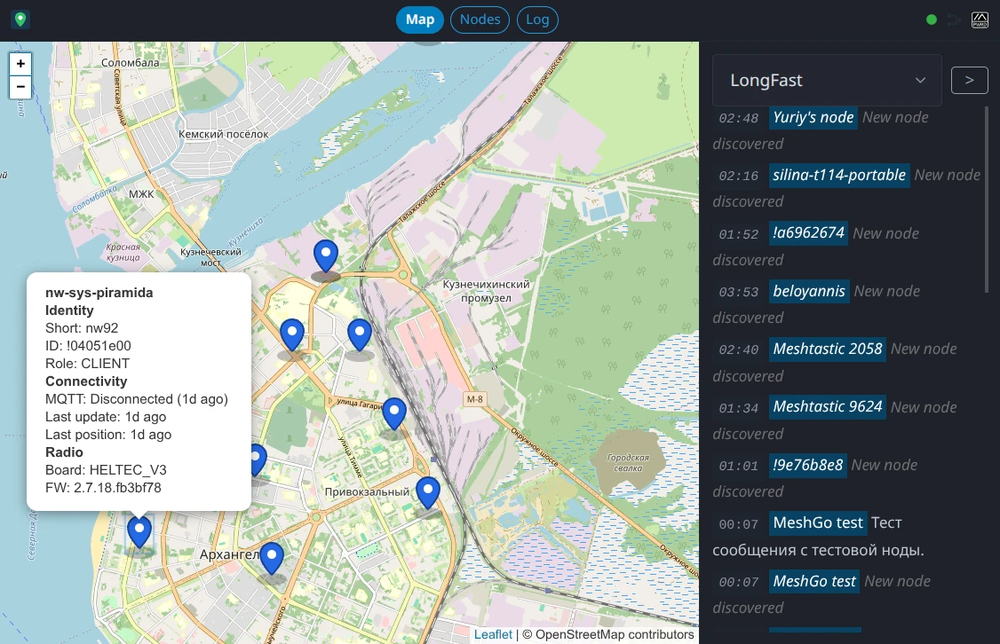
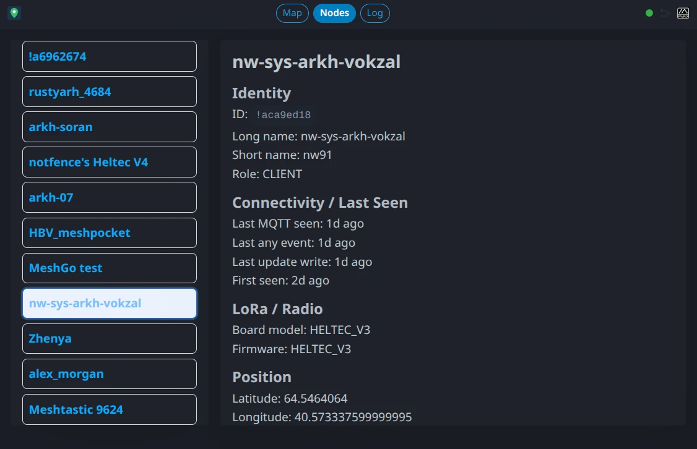
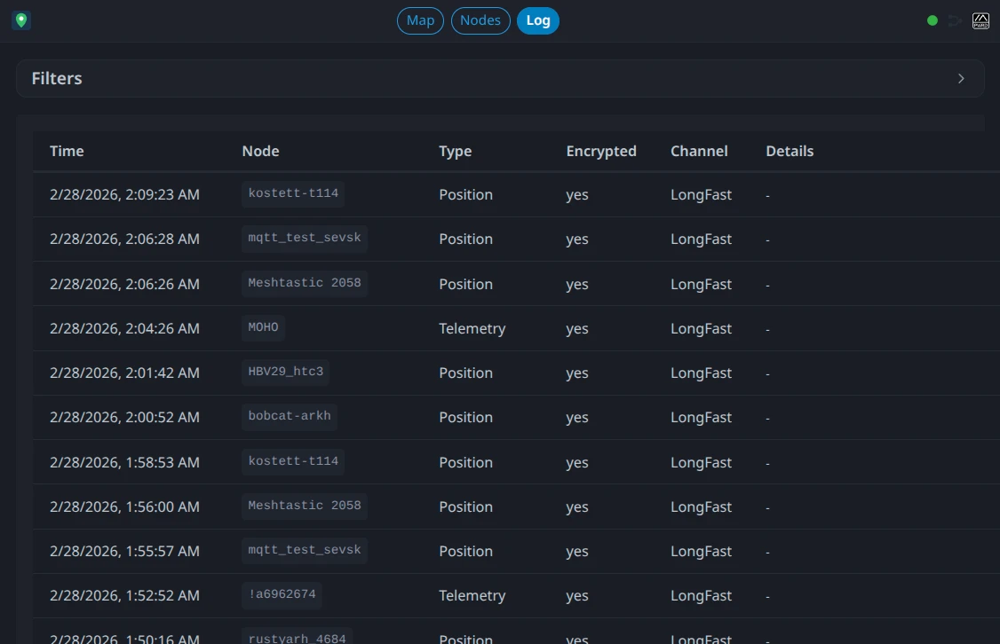

> [!WARNING]
> For reasons beyond my control, project development has been frozen for who knows how long.

# MeshMap Lite

[](https://ci.skobk.in/repos/6)
[](https://git.skobk.in/skobkin/meshmap-lite/releases)

Lightweight read-only Meshtastic regional map and chat viewer.

## Screenshots



<details>
<summary>Node details</summary>


</details>
<details>
<summary>Event log</summary>


</details>

## Run locally

1. `go run ./cmd/server --config ./config.example.yaml`
2. Open `http://localhost:8080`

Local builds report version `dev` by default. Tagged release builds can embed the exact Git tag into the binary via:

```bash
go build -ldflags "-X meshmap-lite/internal/buildinfo.Version=$(git describe --exact-match --tags 2>/dev/null || echo dev)" ./cmd/server
```

## Run in Docker

Docker images are available for deploy from these registries:

- [`skobkin/meshmap-lite`](https://hub.docker.com/r/skobkin/meshmap-lite) (Docker Hub)
- [`ghcr.io/skobkin/meshmap-lite:latest`](https://github.com/skobkin/meshmap-lite/pkgs/container/meshmap-lite/versions) (Github Container Registry)

Docker Compose [example](https://git.skobk.in/skobkin/docker-stacks/src/branch/master/meshmap-lite).

## Frontend dev

1. `cd web`
2. `npm install`
3. `npm run dev`

For backend builds, `npm run build` writes the SPA bundle into
`internal/frontend/assets/dist`, and `go build ./cmd/server` embeds that bundle
into the binary. If those assets are missing, the Go build fails.

## Config

YAML and `MML_` environment variables are supported. ENV keys use `__` as nesting separator.

Example:

```bash
MML_MQTT__ROOT_TOPIC=msh/RU/ARKH
MML_CHANNELS__LONGFAST__PRIMARY=true
```

Reference:

| YAML key                            | ENV key                                   | Default                                               | Description                                                                           |
|-------------------------------------|-------------------------------------------|-------------------------------------------------------|---------------------------------------------------------------------------------------|
| `mqtt.host`                         | `MML_MQTT__HOST`                          | `""`                                                  | MQTT broker host.                                                                     |
| `mqtt.port`                         | `MML_MQTT__PORT`                          | `1883`                                                | MQTT broker port.                                                                     |
| `mqtt.tls`                          | `MML_MQTT__TLS`                           | `false`                                               | Enable TLS for MQTT connection.                                                       |
| `mqtt.client_id`                    | `MML_MQTT__CLIENT_ID`                     | auto-generated stable ID                              | MQTT client ID. Set to keep broker session identity explicit.                         |
| `mqtt.username`                     | `MML_MQTT__USERNAME`                      | `""`                                                  | MQTT username.                                                                        |
| `mqtt.password`                     | `MML_MQTT__PASSWORD`                      | `""`                                                  | MQTT password.                                                                        |
| `mqtt.root_topic`                   | `MML_MQTT__ROOT_TOPIC`                    | `""`                                                  | Root Meshtastic topic prefix. Required.                                               |
| `mqtt.protocol_version`             | `MML_MQTT__PROTOCOL_VERSION`              | `"3.1.1"`                                             | MQTT protocol version.                                                                |
| `mqtt.subscribe_qos`                | `MML_MQTT__SUBSCRIBE_QOS`                 | `1`                                                   | MQTT subscription QoS.                                                                |
| `mqtt.clean_session`                | `MML_MQTT__CLEAN_SESSION`                 | `false`                                               | MQTT clean session flag.                                                              |
| `mqtt.reconnect_timeout`            | `MML_MQTT__RECONNECT_TIMEOUT`             | `10s`                                                 | Reconnect timeout.                                                                    |
| `mqtt.connect_timeout`              | `MML_MQTT__CONNECT_TIMEOUT`               | `10s`                                                 | Connection timeout.                                                                   |
| `mqtt.keepalive`                    | `MML_MQTT__KEEPALIVE`                     | `60s`                                                 | MQTT keepalive interval.                                                              |
| `ingest.traceroute.timeout`         | `MML_INGEST__TRACEROUTE__TIMEOUT`         | `60s`                                                 | Timeout window for ingest-side traceroute lifecycle synthesis.                        |
| `ingest.traceroute.max_entries`     | `MML_INGEST__TRACEROUTE__MAX_ENTRIES`     | `1000`                                                | Max active traceroute tracker entries kept in memory.                                 |
| `ingest.traceroute.final_retention` | `MML_INGEST__TRACEROUTE__FINAL_RETENTION` | `60s`                                                 | How long final traceroute tracker entries stay in memory for duplicate suppression.   |
| `ingest.map_reports.enabled`        | `MML_INGEST__MAP_REPORTS__ENABLED`        | `true`                                                | Enable map report ingest.                                                             |
| `ingest.map_reports.topic_suffix`   | `MML_INGEST__MAP_REPORTS__TOPIC_SUFFIX`   | `"2/map"`                                             | Topic suffix for map reports under root topic.                                        |
| `storage.kv.driver`                 | `MML_STORAGE__KV__DRIVER`                 | `"memory"`                                            | Dedup KV backend driver. Only `memory` is supported.                                  |
| `storage.kv.size`                   | `MML_STORAGE__KV__SIZE`                   | `100000`                                              | Dedup KV max entries.                                                                 |
| `storage.kv.ttl`                    | `MML_STORAGE__KV__TTL`                    | `6h`                                                  | Dedup KV entry TTL.                                                                   |
| `storage.sql.driver`                | `MML_STORAGE__SQL__DRIVER`                | `"sqlite"`                                            | SQL backend driver. Only `sqlite` is supported.                                       |
| `storage.sql.url`                   | `MML_STORAGE__SQL__URL`                   | `"/data/db.sqlite"`                                   | SQL connection URL/path.                                                              |
| `storage.sql.auto_migrate`          | `MML_STORAGE__SQL__AUTO_MIGRATE`          | `true`                                                | Run DB migrations on startup.                                                         |
| `storage.sql.log_max_rows`          | `MML_STORAGE__SQL__LOG_MAX_ROWS`          | `50000`                                               | Max number of log rows to keep. `0` disables pruning.                                 |
| `storage.sql.log_prune_batch_rows`  | `MML_STORAGE__SQL__LOG_PRUNE_BATCH_ROWS`  | `1000`                                                | Extra rows allowed above cap before prune runs; prune then shrinks back to max rows.  |
| `channels[]`                        | `MML_CHANNELS__<CHANNEL_NAME>__...`       | `{}`                                                  | Channel map keyed by channel name. At least one channel is required.                  |
| `channels[].ChannelName.psk`        | `MML_CHANNELS__<CHANNEL_NAME>__PSK`       | `"AQ=="`                                              | Channel PSK (applied during normalization if empty).                                  |
| `channels[].ChannelName.events`     | `MML_CHANNELS__<CHANNEL_NAME>__EVENTS`    | `["text_message","node_info","position","telemetry"]` | Enabled event families. In ENV format use CSV (for example `text_message,node_info`). |
| `channels[].ChannelName.primary`    | `MML_CHANNELS__<CHANNEL_NAME>__PRIMARY`   | `false`                                               | Marks primary channel. At most one channel can be primary.                            |
| `web.listen_addr`                   | `MML_WEB__LISTEN_ADDR`                    | `":8080"`                                             | HTTP listen address.                                                                  |
| `web.base_path`                     | `MML_WEB__BASE_PATH`                      | `"/"`                                                 | Base path for web/API routing.                                                        |
| `web.info.file`                     | `MML_WEB__INFO__FILE`                     | `""`                                                  | Optional Markdown file loaded at startup and shown as a site information modal. Relative paths resolve from process working directory; prefer absolute paths in deployments. |
| `web.chat.enabled`                  | `MML_WEB__CHAT__ENABLED`                  | `true`                                                | Enable chat API/UI features.                                                          |
| `web.chat.default_channel`          | `MML_WEB__CHAT__DEFAULT_CHANNEL`          | first channel name (sorted)                           | Default channel for chat UI/API.                                                      |
| `web.chat.show_recent_messages`     | `MML_WEB__CHAT__SHOW_RECENT_MESSAGES`     | `50`                                                  | Initial recent messages count.                                                        |
| `web.chat.history_window`           | `MML_WEB__CHAT__HISTORY_WINDOW`           | `168h`                                                | Oldest chat history age visible through the chat API/UI.                              |
| `web.ws.heartbeat_interval`         | `MML_WEB__WS__HEARTBEAT_INTERVAL`         | `30s`                                                 | WebSocket heartbeat interval.                                                         |
| `web.ws.stats_interval`             | `MML_WEB__WS__STATS_INTERVAL`             | `60s`                                                 | WebSocket runtime stats emission interval.                                            |
| `web.map.clustering`                | `MML_WEB__MAP__CLUSTERING`                | `false`                                               | Enable marker clustering on map. Disabled by default.                                 |
| `web.map.disconnected_threshold`    | `MML_WEB__MAP__DISCONNECTED_THRESHOLD`    | `60m`                                                 | Node stale/disconnected threshold.                                                    |
| `web.map.topology_cache_ttl`        | `MML_WEB__MAP__TOPOLOGY_CACHE_TTL`        | `10m`                                                 | Shared TTL for the per-node topology/details cache on the frontend and for the global topology snapshot cache on the backend. |
| `web.map.topology_max_edges`        | `MML_WEB__MAP__TOPOLOGY_MAX_EDGES`        | `2000`                                                | Maximum number of topology edges returned by `GET /api/v1/topology/edges` before the response sets `truncated: true`.       |
| `web.map.precision_circles_mode`    | `MML_WEB__MAP__PRECISION_CIRCLES_MODE`    | `"selected"`                                          | Precision circle mode: `none`, `selected`, or `always`.                               |
| `web.map.default_view.latitude`     | `MML_WEB__MAP__DEFAULT_VIEW__LATITUDE`    | `64.5`                                                | Initial map center latitude.                                                          |
| `web.map.default_view.longitude`    | `MML_WEB__MAP__DEFAULT_VIEW__LONGITUDE`   | `40.6`                                                | Initial map center longitude.                                                         |
| `web.map.default_view.zoom`         | `MML_WEB__MAP__DEFAULT_VIEW__ZOOM`        | `13`                                                  | Initial map zoom.                                                                     |
| `web.relevance.telemetry_max_age`   | `MML_WEB__RELEVANCE__TELEMETRY_MAX_AGE`   | `24h`                                                 | Hide telemetry snapshots older than this API/UI relevance window.                     |
| `web.relevance.topology_evidence_max_age` | `MML_WEB__RELEVANCE__TOPOLOGY_EVIDENCE_MAX_AGE` | `72h`                                        | Hide topology evidence older than this API/UI relevance window.                       |
| `web.relevance.map_position_max_age` | `MML_WEB__RELEVANCE__MAP_POSITION_MAX_AGE` | `336h`                                               | Hide map positions and positioned nodes older than this API/UI relevance window.      |
| `web.log.live_updates`              | `MML_WEB__LOG__LIVE_UPDATES`              | `true`                                                | Enable live log updates over WebSocket.                                               |
| `web.log.page_size_default`         | `MML_WEB__LOG__PAGE_SIZE_DEFAULT`         | `100`                                                 | Default log page size (normalized to `1..500`).                                       |
| `web.stats.activity.daily.bucket`   | `MML_WEB__STATS__ACTIVITY__DAILY__BUCKET` | `5m`                                                  | Stats tab daily (24h) activity bucket size; values under `1m` are raised to `1m`.      |
| `web.stats.activity.weekly.bucket`  | `MML_WEB__STATS__ACTIVITY__WEEKLY__BUCKET` | `1h`                                                  | Stats tab weekly (168h) activity bucket size; values under `7m` are raised to `7m`.     |
| `web.stats.software.snapshot_cache_ttl` | `MML_WEB__STATS__SOFTWARE__SNAPSHOT_CACHE_TTL` | `1h`                                            | How long `GET /api/v1/stats/firmware` (current-fleet distribution) is reused.           |
| `web.stats.software.history_cache_ttl`  | `MML_WEB__STATS__SOFTWARE__HISTORY_CACHE_TTL`  | `24h`                                           | How long `GET /api/v1/stats/firmware/history` (weekly history pivot) is reused.         |
| `web.stats.software.history_weeks`  | `MML_WEB__STATS__SOFTWARE__HISTORY_WEEKS`  | `54`                                                 | Number of trailing weeks rendered in the firmware history chart (ending at the current week). |
| `web.stats.software.top_versions`   | `MML_WEB__STATS__SOFTWARE__TOP_VERSIONS`   | `15`                                                 | Top-N versions rendered individually in the history chart; the rest collapse into `(other)`. |
| `web.stats.software.map_report_max_age` | `MML_WEB__STATS__SOFTWARE__MAP_REPORT_MAX_AGE` | `336h`                                          | Nodes that haven't sent a `MapReport` in this window are excluded from the firmware snapshot and from new weekly history rows. Once a row is in history, it stays. |
| `logging.level`                     | `MML_LOGGING__LEVEL`                      | `"info"`                                              | Log level.                                                                            |
| `update_check.enabled`              | `MML_UPDATE_CHECK__ENABLED`              | `true`                                                | Enable release checks shown in the UI.                                                |
| `update_check.interval`             | `MML_UPDATE_CHECK__INTERVAL`             | `12h`                                                 | Refresh interval for configured release sources.                                      |
| `update_check.timeout`              | `MML_UPDATE_CHECK__TIMEOUT`              | `15s`                                                 | Per-source release request timeout.                                                   |
| `update_check.sources[].name`       | `MML_UPDATE_CHECK__SOURCES__0__NAME`     | `"meshmap-lite"`                                      | Stable update source identifier. Increase the numeric index for additional ENV-defined sources. |
| `update_check.sources[].label`      | `MML_UPDATE_CHECK__SOURCES__0__LABEL`    | `"Map"`                                               | User-facing label for the update source.                                              |
| `update_check.sources[].type`       | `MML_UPDATE_CHECK__SOURCES__0__TYPE`     | `"forgejo"`                                           | Release source type. Supported values: `forgejo`, `github`.                           |
| `update_check.sources[].base_url`   | `MML_UPDATE_CHECK__SOURCES__0__BASE_URL` | `"https://git.skobk.in"`                              | API base URL. Required for `forgejo`; optional for `github`, where it defaults to `https://api.github.com`. For GitHub Enterprise use a compatible REST base such as `https://github.example.com/api/v3`. |
| `update_check.sources[].repository` | `MML_UPDATE_CHECK__SOURCES__0__REPOSITORY` | `"skobkin/meshmap-lite"`                            | Repository in `owner/repo` form.                                                      |
| `update_check.sources[].current_version_source` | `MML_UPDATE_CHECK__SOURCES__0__CURRENT_VERSION_SOURCE` | `"buildinfo"`                          | Current-version source. Use `buildinfo` for the running binary version or `none`.      |
| `update_check.sources[].limit`      | `MML_UPDATE_CHECK__SOURCES__0__LIMIT`    | `15`                                                  | Number of releases fetched per source. GitHub values are sent as `per_page` and clamped to `1..100`. |
| `update_check.sources[].pre_releases` | `MML_UPDATE_CHECK__SOURCES__0__PRE_RELEASES` | `false`                                          | Include platform-flagged unstable releases (alpha/beta/RC). For `forgejo`, stable-only mode sends `pre-release=false`; when enabled, the filter is omitted so stable releases remain included. For `github` the per-release `prerelease` flag is honored instead of filtered. |
| `update_check.sources[].post_process` | `MML_UPDATE_CHECK__SOURCES__0__POST_PROCESS` | `true`                                         | Post-process release Markdown before caching it: 40-character commit hashes become commit links, `#123` references become repository issue links, full issue/PR URLs collapse to `owner/repo#123`, and `@user` references become profile links. Set to `false` to keep upstream release bodies unchanged. |

Notes:
- Channel names are preserved as configured.
- ENV overrides are parsed as: `bool` (`true/false`), `int`, `float`, `time.Duration` (`10s`, `60m`, `6h`), or string.
- ENV list entries use numeric path segments, for example `MML_UPDATE_CHECK__SOURCES__0__TYPE=github`.
- Unknown ENV keys are ignored.
- If `web.info.file` is set and the file cannot be read or rendered, startup fails. Changing the file requires restarting the app; clients see changed content again because dismissal is keyed to the Markdown source hash.
- Stats activity periods are normalized to positive durations and capped at 1440 buckets per period. The minimum effective bucket is therefore `1m` for daily and `7m` for weekly; any smaller value is silently raised to the minimum.
- `mqtt.root_topic` must be set and at least one channel must be configured.
- PSK shorthand behavior is documented in [`docs/keys.md`](docs/keys.md).

## API

The canonical API contract source lives in [`internal/apidocs/assets/openapi.yaml`](internal/apidocs/assets/openapi.yaml).

- Interactive docs: [`https://mesh.skobk.in/api/`](https://mesh.skobk.in/api/)
- Raw spec: [`https://mesh.skobk.in/api/openapi.yaml`](https://mesh.skobk.in/api/openapi.yaml)
- Local docs UI: `http://localhost:8080/api/`
- Local raw spec: `http://localhost:8080/api/openapi.yaml`

## Notes

MQTT ingest decodes real Meshtastic protobuf payloads (`ServiceEnvelope`/`MapReport`/`MeshPacket`), with JSON fallback kept for synthetic local tests.
